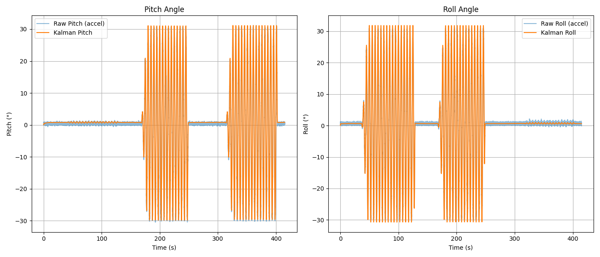

# Kalman Filter for Sensor Fusion

## IMU-Based Orientation Estimation 📐

This repository contains Python scripts to estimate the **3D orientation (Yaw, Pitch, Roll)** of a device using **gyroscope and accelerometer data**, and compares the performance of different estimation methods.

The pipelines are as follows:
- **Euler Angle Integration** (gyroscope only)
- **Quaternion Kalman Filter (gyro only)**
- **Quaternion Kalman Filter (gyro + accelerometer)**

---

## 🔧 Implemented Methods

| Method                                | Description |
|---------------------------------------|-------------|
| `Euler Angle Integration (Gyro)`      | Uses nonlinear Euler equations to integrate angular velocity (`p`, `q`, `r`) into Euler angles. Frame-aware but suffers from drift. |
| `Quaternion Kalman Filter (Gyro Only)`| Predict-only Kalman filter using quaternion propagation and gyroscope input. No correction from accelerometer. |
| `Quaternion Kalman Filter (Gyro + Accel)` | Full Kalman filter using gyroscope for prediction and accelerometer for orientation correction via quaternion update. |

---

## 📈 Results

### 1. **Euler Angle Integration from Gyroscope (Nonlinear)**

Nonlinear frame-aware integration of Euler angles using only angular velocity. Simple and fast but can drift over time without correction.


---

### 2. **Quaternion Kalman Filter (Gyro + Acceleration)**

Full sensor fusion using gyroscope for predicting orientation and accelerometer for correcting pitch and roll drift. Stable and accurate.



---

### 3. **Quaternion Kalman Filter (Gyro Only)**

Performs prediction using quaternion kinematics and gyroscope readings but **no accelerometer correction**, so orientation drifts slowly over time.


## 🚀 How to Run

Install dependencies:

```bash
pip install numpy pandas matplotlib
```

Run each script to generate results and plots:

```bash
python euler_gyro_integration.py
python quaternion_kalman_gyro_only.py
python kalman_filter_gyro_accel.py
```

--- 

## 🧠 Author

Developed by Megha Kalia
Inspired by the great lecture series by [Dr. Shane Ross](https://www.youtube.com/@ProfessorRoss)

